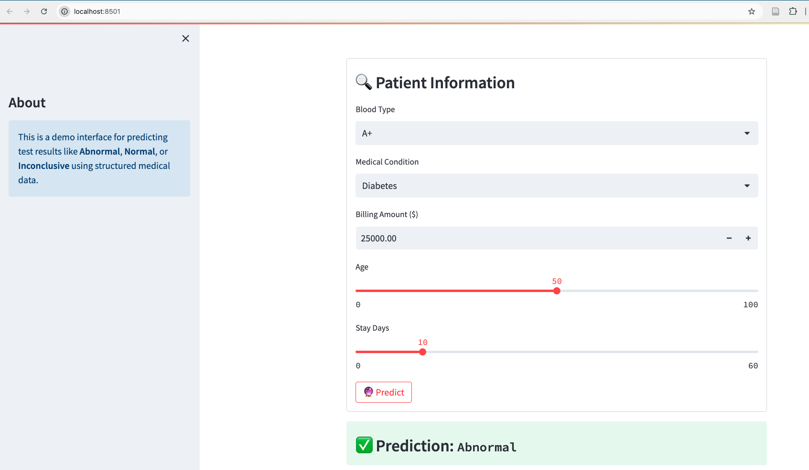

#  Medical Test Result Prediction

This project is an end-to-end medical AI application that predicts patient test results based on structured clinical data.

##  Features

-  Machine Learning model (ensemble) trained on real medical dataset
-  Predict test result: `Abnormal`, `Normal`, or `Inconclusive`
-  Streamlit-based Web UI for interactive usage
-  FastAPI backend for programmatic access
-  Visual confidence (probability) bar chart
-  Encoders & scaler included for inference

##  How to Run the App

###  Step into the app folder
```bash
cd app
```

###  Run FastAPI backend
```bash
fastapi run main.py
```
Visit: [http://127.0.0.1:8000/docs](http://127.0.0.1:8000/docs) to test the API.

---

###  Run Streamlit Web App
```bash
streamlit run app.py
```
Visit: [http://localhost:8501](http://localhost:8501) to use the web UI.

### Web application

<p align="center">
    
</p>

---

Next step
---

- [x] Deploy on Docker
- [ ] Deploy on AWS
- [ ] Model monitoring and MLOps building

---
Data source: [Kaggle Healthcare Dataset](https://www.kaggle.com/code/prashant1310/health-care-dataset/input)